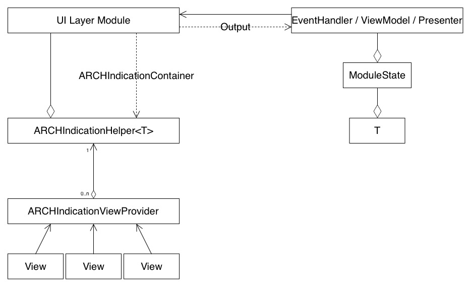

# Индикация



Во время долгих операции или когда отсутвуют данные, экран не должен пустовать. 
Как правило показывается специальное вью, с соответствующей информацией.

Существуют 3 базовых типа:

- Загрузка
- Ошибка
- Данные пусты

## Состав фреймворка

### ARCHIndicationHelper<T>

Класс. Управляет отоборажением вьюх для нужного типа индикации.
Для правильной работы нужно указать **container** и **providers**

### ARCHIndicationContainer

Протокол. Описывает куда и как будут помещаться вьюхи индикации.
Для позиционирования используется UILayoutGuide, чтобы не создавать лишнюю вьюху
Имеется готовое расширение для UIViewController, которое под капотом всё это настраивает.

### ARCHIndicationViewProvider

Протокол, через него ``ARCHIndicationHelper`` получает вьюху или обертку над ней.
На своем проекте можете более детально настоить **Provider**, может сразу хранить ссылки на вьюхи или выступать в качетсве фабрики.

### ARCHIndicationViewProxy

Обертка для работы сразу с несколькими вьюхами.

### ARCHIndicationTypes

Это уникальный id описывающий нужный тип индикации.
Данная структура реализуют возможности ``OptionSet``, что позволяет безопасно расширять пулл типов индикации.

## Установка

### Требования

- iOS 10.0+
- Swift 4.1
- Xcode 9

### [Carthage](https://github.com/Carthage/Carthage)

Для интеграции **HHIndication** пропиши в `Cartfile`:

```
github "Heads-and-Hands/architecture-team-a-ios"
```

Запусти команду `carthage update --platform ios`.  Добавь в проект `HHModule.framework` и `HHIndication.framework`

## Использование

1. *[Один раз]* Создай модель данных, выполняющая протокол ARCHIndicationState
2. *[Один раз]* Создай вьюшки для индикации
3. *[Один раз]* Создай **Provider**, реализующий протокол ``ARCHIndicationViewProvider``
4. *[Опционально]* Упрости инициализацию ARCHIndicationHelper:

````
class IndicationHelper: ARCHIndicationHelper<IndicationState> {

    static var defaultProviders: [ARCHIndicationTypes: ARCHIndicationViewProvider] {
        let type: ARCHIndicationTypes = [.loading, .empty, .error]
        return [type: IndicationViewProvider()]
    }

    override init() {
        super.init()

        providers = IndicationHelper.defaultProviders
    }
}
````
5. Подключи хелпер во UI слой, укажи **container**
6. Добавь в состояние модуля поле типа объекта, созданного на (1) шаге
