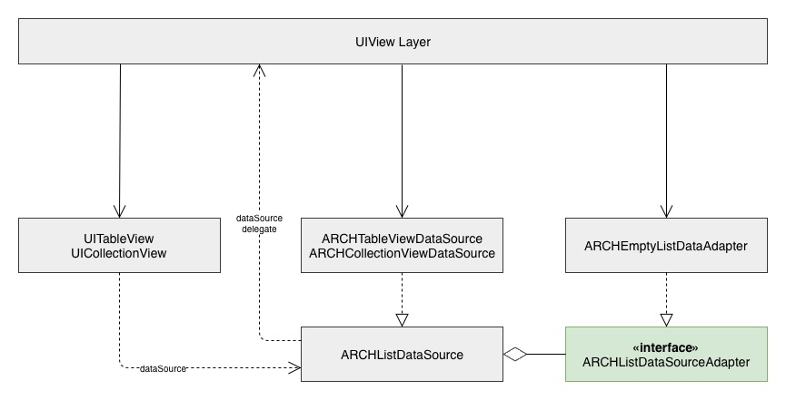

# Работа с UITableView/UICollectionView

## Структура



### ARCHListDataSource

Базовый класс. Промежуточный слой между **UITableView/UICollectionView** и данными. Формирует ячейки на основе данных, полученных от **dataAdapter** реализующий протокол  ````ARCHListDataSourceAdapter````

Работает с:
- ячейками  (реализующие протокол ````ARCHCell````)
- данными  (реализующие протокол ````ARCHCellViewModel````)

В DataSource реализованны методы:
* количество секций
* количество ячеек в секции
* формирование ячейки

Все остальные функции ````UITableViewDataSource/UICollectionViewDataSource```` проксируются через свойство **dataSource**.

Для более детальной настройки ячеек используете **delegate**, реализующий протокол ````ARCHListDataSourceDelegate````.

Реализации:

- ````ARCHTableViewDataSource```` для **UITableView**
-  ````ARCHCollectionViewDataSource```` для **UICollectionView**

### ARCHListDataSourceAdapter

Протокол адаптирующий ваши данные для DataSource. 

### ARCHEmptyListDataAdapter

Дженирик класс, реализующий протокол ````ARCHListDataSourceAdapter````. 
Используется для хранения массива и адаптации к отображению одного типа ячеек в одной секции.
Для автоматической конвертации данных в  во вью модели, используйте протокол ````ARCHModelAbstractInitilizable````.
Или при инициализации укажите свой маппинг данных.

## Установка

### Требования

- iOS 10.0+
- Swift 4.1
- Xcode 9

### [Carthage](https://github.com/Carthage/Carthage)

Для интеграции **HHList** пропиши в `Cartfile`:

```
github "Heads-and-Hands/architecture-team-a-ios"
```

Запусти команду `carthage update --platform ios`. Добавь в проект `HHList.framework`

## Использование

### 1. [Установи шаблон ячейки](../../templates.md)

### 2. Создай новую ячейку

При помощи шаблона TableViewCell или CollectionViewCell создай файлы для ячейки:
- Cell
- CellViewModel
- Cell.xib удали если не используешь, а если используешь поставь галочку http://prntscr.com/kiweng

### 3. Настрой DataAdapter

Можешь реализовать протокол ````ARCHListDataSourceAdapter````, а можешь воспользоваться уже готовым, например:

````
lazy var dataAdapter = ARCHEmptyListDataAdapter<SimpleEntity, ExampleCellViewModel>()
````

### 4. Настрой DataSource

1. Зарегистрируй класс ячейки:

````
dataSource.register(cell: ExampleCell.self, for: ExampleCellViewModel.self)
````

2. Подключи **dataAdapter**
3. *Опционально*. Для более детальной настройки подключи **dataSource** или **delegate**

### 5. Установи dataSource у UITableView/UICollectionView
