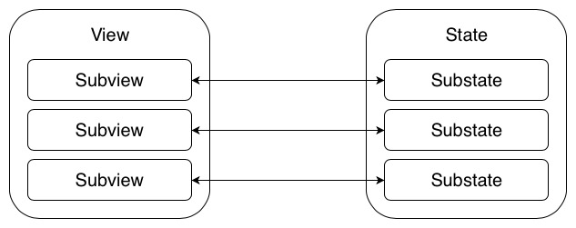

# Авторендеринг состояния модуля

В большинстве случаев, **State** и **View** являются композицей более простых элементов. Каждый UI элемент умеет "показывать" конкретный тип данных, исходя из этого можно построить четкое соответсвие с данными:



Это можно провернуть при помощи рефлексии, ``Mirror(reflecting:)`` - объект класса предоставляет доступ к свойствам передоваемого объекта.

У **View**, при помощи Мirror, среди свойств находим дочерние UI компоненты с реализованным протоколом:

````
protocol ARCHViewInput: class {
    
    func update(state: Any?)
    func set(visible: Bool)
    func typeExist(state: Any?) -> Bool
}
````

Аналогично, пробегаем по всем свойствам **State**. Если UI компонент может обработать переданный тип данных ``typeExist -> true``, тогда вызываем функцию ``update(state: Any?)``.

У данного протокола есть джинерик наследник:

````
protocol ARCHViewRenderable: ARCHViewInput {
    associatedtype ViewState: Any
    func render(state: ViewState)
}
````
который работает с конкретным типом данных, и для него написано расширение  проверяющее все соответсвия типов.

## Автоматическое скрытие вьюх

Все просто, сделай свойство с данными для вьюхи опциональным. Нет данных (**nil**) - вью скрывается, есть данные - вью показывается

## Использование

1. Создай UI компонент (наследник ``UIView`` или хелпер)
2. Создай **viewModel/state** для компонента
3. Настрой протокол ``ARCHViewRenderable`` у UI компонента
4. Во вьюконтроллере создай свойство с вьюхой
5. *[Опционально]* Для отключения авторендеринга UI компонента, добавь его в ``autorenderIgnoreViews``
6. *[Опционально]* Для кастомной настройки переопредели метод ``render(state: State)`` у ``ViewController``
 
## Плюсы

- Тебе не нужно писать повторяющийся код:

````
    // Some viewController
    func render(state: ViewState) {
        dataAdapter.update(state: state.list)
        tableView.reloadData
        
        indicationManager.update(state: state)
    }

    // Some view or ui manager/helper
    func update(state: Any?) {
        guard let state = state as? <Some type> else {
            return
        }
        
        // Some code
    }
````
- [В будущем] данную логику можно покрыть тестами

## Минусы

- Не может работать одновременно с несколько одинаковыми вьюхами
