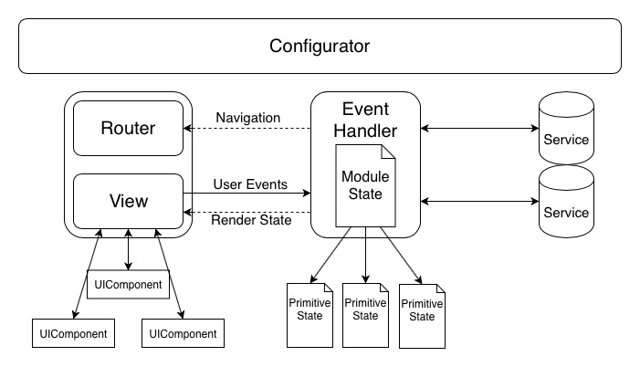
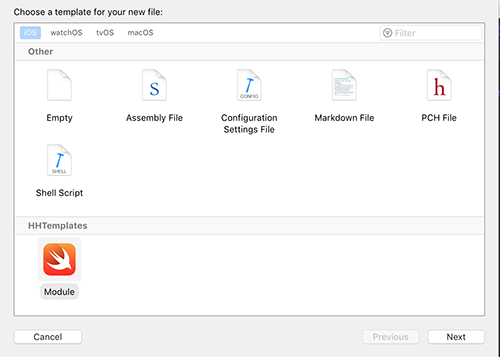

# Архитектура модуля



## Структура модуля

### Configurator

Элемент ответственный за инициализацию модуля, устанавливает все зависимости. Конфигуратор возвращает объект типа ARCHRouter, чтобы позволяет в качестве модуля создавать всё что угодно.  

### View + Router

Данный слой ответственен за визуальную часть модуля. Весь UI должен собираться из более мелких компонентов и/или дочерних модулей. Слой должен быть максимально пассивным, т.е. не принимает ни каких решений. Пользовательские эвенты (нажатие на кнопки, жесты и т.д.) транслируются в  *Event Handler*. Данные для отображения поступают через фунцию ````func render(state: ViewState)```` 

Для ускорение разработки,  передаваймый стейт автоматически разбирается на состовляющие, которые транслируются в нужные вьюхи. Подробно написано [тут](AUTORENDERING.md)  

Т.к. слой тесно связан с UI, он так же отвественен за навигацию. Для этого нужно подключить протокол ARCHRouter. 

Навигация осуществляется при помощи передаваемых опций, на данный момент есть Push, Present, Window. Данный подход позволяет более гибко настраивать навигацию на конкретном проекте. 

### Event Handler

Данный слой отвественен за логику модуля.  Занимается обработкой данных. Все данные получаемые хендлером фиксируются в объекте State, которые отправляется на рендеринг. Желательно State делать структурой, благодаря этому любое изменение состяния будет автоматически вызывать пересовку View.
Несколько изменений стейта можно объеденить в одну транзакцию следующими способами:
1. 
````
beginStateChanges()
// Some code
commitStateChanges()
````
2. 
````
updateState {
    // Some code 
}
````
3. 
````
var state = self.state
// Some code
self.state = state
````

``func viewSetNeedsRedraw`` - принудительно отправляет стейт на отрисовку.  

Так же можно настроить определенные правила для изменения стейта, например для реализации связанных свойств. Более подробно [тут](PREPROCESSING.md)

Эвент хендлер используется для обмена данными между другими модулями при помощи протоколов *ModuleInput и *ModuleOutput. 

### Module State

Структура описывающая состояние модуля. Представляет собой комбинацию состояний примитивных UI компонентов. Не содержит в себе ни какой логики и преобразований.

## Установка

### Требования

- iOS 10.0+
- Swift 4.1
- Xcode 9

### [Carthage](https://github.com/Carthage/Carthage)

Для интеграции **HHModule** пропиши в `Cartfile`:

```
github "Heads-and-Hands/architecture-team-a-ios"
```

Запусти команду `carthage update --platform ios`.  Добавь в проект `HHModule.framework`

## Использование

### [Установи шаблон модуля](../../templates.md)

###  Создай новый модуль

Создай папку для модуля на диске, добавь её в проект

File -> New -> File ... -> В открывшимся окне выбери шаблон **Module**


