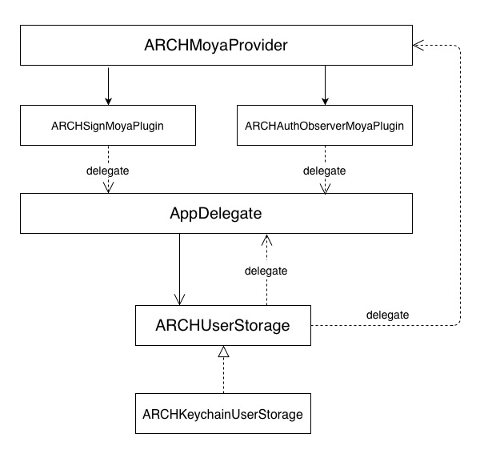

# Взаимодействие с сетью



Для общения с сервером используется [Moya](https://github.com/Moya/Moya) - надстройка над [Alamofire](https://github.com/Alamofire/Alamofire)
В провайдер добавлена функциональность:

- парсинг ответа
- маппинг всех ошибок к единому типу ````ARCHNetworkError````
- повторное выполнение запросов с 401 ошибкой после перелогина (нужно настроить делегат UserStorage)

Дополнительно расширить возможности провайдера можно при помощи плагинов:

- **ARCHLoggerMoyaPlugin** -  отображение логов запросов
- **ARCHSignMoyaPlugin** - добавляет токен авторизации в хедер запросов
- **ARCHAuthObserverMoyaPlugin** - слушает 401 ошибку

Данные пользователя и токен доступа сохраняется в **Keychain** при помощи ````ARCHKeychainUserStorage````

## Установка

### Требования

- iOS 10.0+
- Swift 4.1
- Xcode 9

### [Carthage](https://github.com/Carthage/Carthage)

Чтобы интегрировать **HHNetwork** пропишите в `Cartfile`:

```
github "Heads-and-Hands/architecture-team-a-ios"
```

Запусти команду `carthage update --platform ios`.  Добавь в проект:

- HHNetwork.framework
- Alamofire.framework
- Moya.framework
- Result.framework
- KeychainAccess.framework

## Настройка окружения

### 1. Создай ````enum ApiTarget```` и подключи протокол ````ARCHTargetType````

### 2. Создай модельку для пользователя и токена. Реализуй протоколы ````ARCHUser```` и ````ARCHToken```` соотвественно 

### 3. В менеджере зависимостей настрой **синглтон** ````UserStorage````

### 4. Настрой делегаты

````
extension AppDelegate: ARCHAuthObserverMoyaPluginDelegate {

    func didExpiredAuthToken() {
        // Можете сохранить стек в свойство
        authBufferedController = window?.rootViewController

        // Показываем экран авторизации
        window?.rootViewController = <Auth Module>
    }
}

extension AppDelegate: ARCHSignMoyaPluginDelegate {

    var signHeaderFields: [String: String] {
        let userStorage = <DI userStorage>
        if let token = userStorage.token?.value {
            return ["X-Auth-Token": token]
        } else {
            return [:]
        }
    }
}

extension AppDelegate: ARCHUserStorageDelegate {

    func didUpdateUser(from: ARCHUser?, to: ARCHUser?) {
        if let from = from, let to = to, from.primaryKey == to.primaryKey, let rootVC = authBufferedController {
            // Пользователь перелогинился, можете тут восстановаить стек экранов
            window?.rootViewController = rootVC
        } else {
            // Показ следующего экрана после авторизации
            // Например, через LaunchManager
        }
    }
}
````

### 5. Настрой плагины

````
private var loggerMoyaPlugin: PluginType {
    return ARCHLoggerMoyaPlugin(printBlock: { text in
        // Либо вывод через другой логгер
        print("\(text)")
    })
}

private var authObserverPlugin: PluginType {
    let plugin = ARCHAuthObserverMoyaPlugin()
    plugin.delegate = application.delegate as? ARCHAuthObserverMoyaPluginDelegate
    return plugin
}

private var activityMoyaPlugin: PluginType {
    return NetworkActivityPlugin(networkActivityClosure: { activityChangeType, _ in
        switch activityChangeType {
        case .began:
            self.application.isNetworkActivityIndicatorVisible = true
        case .ended:
            self.application.isNetworkActivityIndicatorVisible = false
        }
    })
}

private var signMoyaPlugin: PluginType {
    let plugin = ARCHSignMoyaPlugin()
    plugin.delegate = application.delegate as? ARCHSignMoyaPluginDelegate
    return plugin
}
````

### 6. Настрой ARCHMoyaProvider

````
var apiProvider: ApiProvider {
    let provider = ApiProvider(
        plugins: [signMoyaPlugin, loggerMoyaPlugin, activityMoyaPlugin, authObserverPlugin]
    )
    // Настраивается если нужно после логина повторно выполнить запросы с 401 ошибкой
    userStorage.add(delegate: provider)
    return provider
}
````

## Использование 

````
apiProvider?.requestTarget(.main, for: ARCHApiResponse<MainResponse>.self, completion: { result in
    switch result {
    case let .success(response):
        print("\(response)")
    case let .failure(error):
        print("\(error)")
    }
})
````
