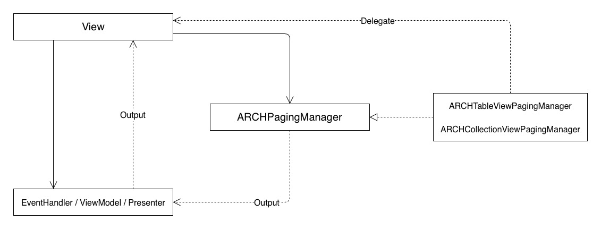

# Постраничная загрузка данных



``ARCHPagingManager`` управляет постраничной загрузкой данных основанных на **limit** и **offset**.

Для выполнения загрузки данных доступны функции:

- ``func willDisplayCell(indexPath: IndexPath)`` - запуск загрузки при необходимости
- ``func performLoadNextData()`` - запросить загрузку следующей страницы
- ``func performRefreshData()`` - запросить загрузку данных с нуля

Выполнение запроса делегируется через свойство **output**:

````
/**
@param offset - смещение
@param pageSize - кол-во загружаемых элементов
@param completion - клажура (Count loaded items: Int?, Total items: Int?), в случае ошибки передавать (nil, nil)
*/
func performRequest(offset: Int, pageSize: Int, completion: @escaping ARCHPagingManagerCompletion) -> ARCHPagingManagerCancellable?
````

Возвращаемый запрос должен выполнять протокол ``ARCHPagingManagerCancellable``, т.к. сетевой слой может быть построен на RxSwift, Promise и т.д. Имеется уже готовая реализация этого протокола - ``ARCHPagingManagerRequestWrapper``

Можешь использовать экземляр класса ``ARCHPagingManager`` и самостоятельно настроить вызов функции ``willDisplayCell``. Или  использовать уже готовые адаптации для UITableView и UICollectionView, сразу подключаясь к делегату вьюхи. Про одновременную работу с несколькими делегатами написано [тут](../../Source/HHBestPractice/Multidelegate.md)

## Установка

### Требования

- iOS 10.0+
- Swift 4.1
- Xcode 9

### [Carthage](https://github.com/Carthage/Carthage)

Для интеграции **HHPagingManager** пропиши в `Cartfile`:

```
github "Heads-and-Hands/architecture-team-a-ios"
```

Запусти команду `carthage update --platform ios`. Добавь в проект:

- `HHPagingManager.framework`
